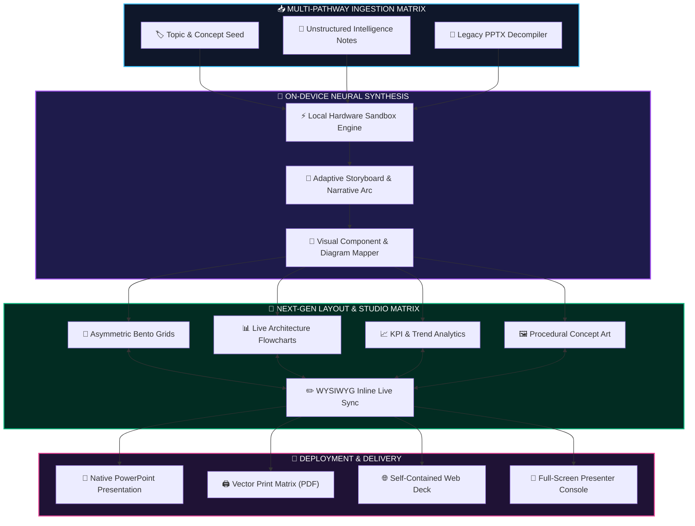
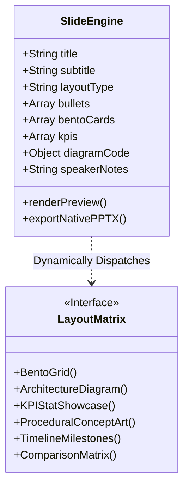

<div align="center">

```
  ███████╗██╗     ██╗██████╗ ███████╗ ██████╗ ███████╗███╗   ██╗     █████╗ ██╗
  ██╔════╝██║     ██║██╔══██╗██╔════╝██╔════╝ ██╔════╝████╗  ██║    ██╔══██╗██║
  ███████╗██║     ██║██║  ██║█████╗  ██║  ███╗█████╗  ██╔██╗ ██║    ███████║██║
  ╚════██║██║     ██║██║  ██║██╔══╝  ██║   ██║██╔══╝  ██║╚██╗██║    ██╔══██║██║
  ███████║███████╗██║██████╔╝███████╗╚██████╔╝███████╗██║ ╚████║██╗ ██║  ██║██║
  ╚══════╝╚══════╝╚═╝╚═════╝ ╚══════╝ ╚═════╝ ╚══════╝╚═╝  ╚═══╝╚═╝ ╚═╝  ╚═╝╚═╝
```

<h3>⚡ NEXT-GEN ON-DEVICE PRESENTATION INTELLIGENCE ⚡</h3>
<p><strong>Autonomous Neural Synthesis • 100% Local Hardware Execution • Zero Cloud Data Leakage</strong></p>

<p>
  
  
  
  
</p>

<p>
  <a href="#-overview">Overview</a> •
  <a href="#-architectural-pipeline">Architecture</a> •
  <a href="#-core-capabilities">Capabilities</a> •
  <a href="#-visual-intelligence--layout-engine">Visual Engine</a> •
  <a href="#-privacy-fortress">Zero-Leakage Fortress</a> •
  <a href="#-holographic-presenter-console">Presenter Console</a>
</p>

<br />

<p>
  <strong>SlideGen.AI Studio</strong> is an autonomous on-device presentation designer. 
  <br />
  Transform brief conceptual prompts, unstructured intelligence documents, or legacy slide files into structured, visually engaging presentations directly on your local hardware.
</p>

</div>

---

## 🛰️ System Architecture Pipeline



---

## ⚡ Core Capabilities

### 1. 📥 Multi-Pathway Ingestion Matrix
- **Conceptual Seed Synthesis**: Enter a single topic title (e.g., *Quantum Encryption Matrix*, *Autonomous Transport*) and the neural engine autonomously structures a multi-chapter executive narrative.
- **Unstructured Intelligence Parser**: Paste raw documentation, research notes, or unstructured bullet points $\rightarrow$ the system analyzes key takeaways, structures chapters, and generates presenter notes.
- **Legacy Deck Decompiler**: Drag and drop existing presentation files to decompile hierarchies, text blocks, and presenter notes for instant modern layout restyling.

### 2. 🍱 Visual Intelligence & Diagram Engine
- **📊 Interactive Architecture Flowcharts**: Generates live vector diagrams, system topologies, and process flowcharts directly on slides.
- **🍱 Asymmetric Bento Grids**: Modern multi-card information matrices with accent indicators and takeaway badges.
- **📈 KPI & Metric Showcase**: High-impact quantitative statistics (`+140%`, `$4.5M`, `99.9%`) paired with context indicators.
- **🖼️ Procedural Vector Concept Art**: Generates dynamic abstract and geometric concept visuals on-the-fly.
- **⏳ Strategic Timelines & Roadmaps**: Horizontal milestone sequences connected with step badges.
- **👥 Contributor & Team Matrices**: Team showcase cards featuring avatar badges, leadership roles, and bios.

### 3. ✏️ Interactive Slide Studio (WYSIWYG Inline Engine)
- **Direct Live Editing**: Click any title, bullet point, metric number, or flowchart node directly on the slide viewport with real-time two-way synchronization.
- **Visual Thumbnail Strip**: Horizontal navigation carousel with numbered slide markers and layout badges.
- **Per-Slide Layout Swapper**: Transform any individual slide between Bento, Flowchart, Metric, or Split layout in 1 click without losing text.
- **Curated Vector Icon Picker**: Click any icon across cards and timelines to swap it from an onboard vector library.



---

## 🔒 Zero-Leakage Privacy Fortress

SlideGen.AI operates under a strict **Zero-Cloud-Leakage Guarantee**:

```
+-------------------------------------------------------------+
|               🛡️ ZERO-LEAKAGE HARDWARE SANDBOX               |
+-------------------------------------------------------------+
|  [ Ingested Content / Business Plans / Confidential Notes ]  |
|                               │                             |
|                               ▼                             |
|              ⚡ 100% LOCAL COMPUTE PIPELINE ⚡               |
|      (Processed Entirely Inside Local CPU / GPU Cores)       |
|                               │                             |
|                               ▼                             |
|             [ Generated High-Impact Presentation ]           |
|                                                             |
|   ❌ ZERO External API Calls    ❌ ZERO Telemetry Logging    |
|   ❌ ZERO Cloud Transmissions   ✅ 100% Offline Capable     |
+-------------------------------------------------------------+
```

---

## 🎤 Holographic Presenter Console

Launch a full-screen presenter control environment designed for live delivery:

- **Audience Display Viewport**: Crystal clear 16:9 presentation projection.
- **Next-Slide Radar**: Real-time thumbnail preview of the upcoming slide to maintain pacing.
- **Mission Clock Timer**: Integrated execution timer with start, pause, and reset controls.
- **Embedded Teleprompter Notes**: Real-time presenter notes synchronized per slide.
- **Keyboard Command Navigation**: Seamless transition control via arrow keys, spacebar, and escape shortcuts.

---

## 🎨 62 Futuristic Theme Matrices

Switch visual atmospheres instantly across 62 built-in curated palettes:

| Atmospheric Class | Visual Characteristic | Accent Aura |
| :--- | :--- | :--- |
| **Cyberpunk** | High-contrast deep carbon with neon cyan & hot magenta | `#22d3ee` / `#f472b6` |
| **Midnight Aurora** | Deep oceanic gradient with crystalline teal glowing highlights | `#00e5ff` |
| **Holographic Dream** | Iridescent multi-stop vibrant gradient spectrum | `#ffeb3b` |
| **Slate Modern** | Matte architectural slate with sharp cyan indicators | `#06b6d4` |
| **Executive Dark** | Obsidian background paired with brushed gold typography | `#d4af37` |
| **Emerald Elegance** | Rich forest green with warm amber accents | `#ffd700` |

---

## 🚀 Deployment & Multi-Format Delivery

- **💾 Native PowerPoint (`.pptx`)**: Generates true native vector shapes, bento boxes, large numeric stat callouts, editable charts, and embedded speaker notes.
- **🖨️ Vector Print Matrix (PDF)**: Clean print stylesheet formatting all slides into full-page vector documents.
- **🌐 Standalone Web Deck (`.html`)**: Downloads a self-contained single-file offline presentation.

---

<div align="center">
  <p><strong>SlideGen.AI Studio • The Future of Autonomous On-Device Presentation Design</strong></p>
</div>
