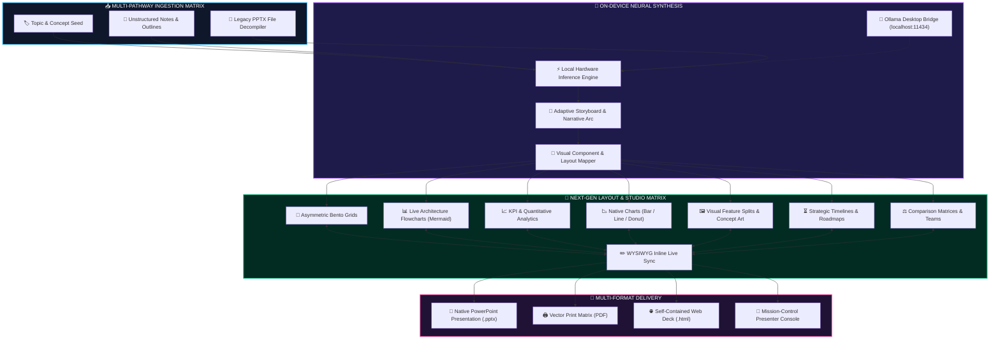

<div align="center">

```
  ███████╗██╗     ██╗██████╗ ███████╗ ██████╗ ███████╗███╗   ██╗     █████╗ ██╗
  ██╔════╝██║     ██║██╔══██╗██╔════╝██╔════╝ ██╔════╝████╗  ██║    ██╔══██╗██║
  ███████╗██║     ██║██║  ██║█████╗  ██║  ███╗█████╗  ██╔██╗ ██║    ███████║██║
  ╚════██║██║     ██║██║  ██║██╔══╝  ██║   ██║██╔══╝  ██║╚██╗██║    ██╔══██║██║
  ███████║███████╗██║██████╔╝███████╗╚██████╔╝███████╗██║ ╚████║██╗ ██║  ██║██║
  ╚══════╝╚══════╝╚═╝╚═════╝ ╚══════╝ ╚═════╝ ╚══════╝╚═╝  ╚═══╝╚═╝ ╚═╝  ╚═╝╚═╝
```

<h3>⚡ NEXT-GEN ON-DEVICE PRESENTATION INTELLIGENCE ⚡</h3>
<p><strong>Autonomous Neural Synthesis • 100% Local Hardware Execution • Zero Cloud Data Leakage • 130 Dynamic Themes</strong></p>

<p>
  
  
  
  
  
</p>

<p>
  <a href="#-overview">Overview</a> •
  <a href="#-system-architecture-pipeline">Architecture</a> •
  <a href="#-core-capabilities">Capabilities</a> •
  <a href="#-130-dynamic--futuristic-themes">130 Themes</a> •
  <a href="#-designer-typography--procedural-decorators">Typography & Decorators</a> •
  <a href="#-zero-leakage-privacy-fortress">Privacy Fortress</a> •
  <a href="#-holographic-presenter-console">Presenter Console</a> •
  <a href="#-deployment--quick-start">Deployment</a>
</p>

<br />

<p>
  <strong>SlideGen.AI Studio Pro</strong> is a local-first, on-device presentation designer. 
  <br />
  Transform brief concepts, raw notes, or uploaded PPTX files into executive slide decks with automatic visual layouts, Mermaid flowcharts, Bento grids, and native PowerPoint exports directly on your hardware.
</p>

</div>

---

## 🛰️ System Architecture Pipeline



---

## ⚡ Core Capabilities

### 1. 📥 Multi-Pathway Ingestion Matrix
- **Conceptual Seed Synthesis**: Enter a single topic title (e.g., *Quantum Computing Breakthroughs*, *Autonomous Vehicles*) and the neural engine synthesizes a multi-chapter executive deck.
- **Unstructured Notes & Outlines**: Paste raw research documents, lecture notes, or markdown outlines $\rightarrow$ the system analyzes key takeaways, structures slides, and crafts speaker notes.
- **Legacy PPTX Decompiler**: Drag and drop existing `.pptx` files to extract hierarchy, bullet points, and speaker notes for instant modern layout restyling.

### 2. 🍱 Visual Intelligence & Layout Engine
- **🍱 Asymmetric Bento Grids**: Multi-card information matrices with accent indicators and takeaway badges.
- **📊 Interactive Architecture Flowcharts**: Generates live vector diagrams, system topologies, and process flowcharts using Mermaid.js.
- **📈 KPI & Metric Showcases**: High-impact quantitative statistics (`+140%`, `$4.5M`, `99.9%`) paired with trend labels.
- **📈 Native Interactive Charts**: Live Chart.js bar, line, and donut data visualizations rendered on the canvas.
- **⏳ Strategic Timelines & Roadmaps**: Horizontal milestone sequences connected with numbered step badges.
- **⚖️ Comparison Matrices & Team Grids**: Side-by-side comparative breakdowns and team contributor showcases.

### 3. ✏️ Interactive Slide Studio (WYSIWYG Workbench)
- **Direct Live Editing**: Click any title, subtitle, bullet point, metric number, or flowchart node directly on the slide viewport with real-time two-way synchronization.
- **Floating Studio Toolbar**: Instant layout switcher, custom accent color picker with color-wheel ring, slide reordering, duplication, and deletion.
- **Filmstrip Thumbnail Strip**: Horizontal navigation carousel with numbered slide markers and active glow rings.
- **Vector Icon Picker**: Click any icon across cards and timelines to swap it from an onboard curated icon library.

---

## 🎨 130 Dynamic & Futuristic Themes

Explore **130 human-crafted themes** across curated design aesthetics:

| Category Filter | Atmospheric Signature | Signature Typography | Key Themes |
| :--- | :--- | :--- | :--- |
| **Futuristic & Deep Tech** | Neural quantum grids, hyperlime accents, cyber telemetry | `Space Grotesk`, `Orbitron`, `Plus Jakarta Sans` | *Quantum Superposition*, *Neural Mesh*, *Zero-Point Energy*, *Bio-Synthetic DNA* |
| **Cyberpunk & HUD** | Deep carbon obsidian, glowing neon cyan, radar scanlines | `Orbitron`, `JetBrains Mono`, `Righteous` | *Cyberpunk Neon*, *Neon Tokyo 2077*, *Sub-Atomic Pulse*, *Glitch Protocol* |
| **Spatial & VisionOS** | Frosted glassmorphism, iridescent auroras, specular bevels | `Outfit`, `Unbounded`, `Sora` | *VisionOS Spatial Glass*, *Holographic Dream*, *Prismatic Refraction* |
| **Aerospace & Sci-Fi** | Deep space starlight, cockpit telemetry, orbital rings | `JetBrains Mono`, `Orbitron`, `Space Grotesk` | *Deep Space Cosmos*, *Orbital Trajectory*, *Titan Cryo-Ice*, *Hyperspace Warp* |
| **Luxury Noir & Gold** | Obsidian black, brushed Champagne gold, royal emerald | `Cinzel`, `Playfair Display`, `Syne` | *Executive Dark*, *Midnight Gold Sovereign*, *Velvet Noir*, *Haute Horlogerie* |
| **Swiss & Editorial** | High-contrast brutalism, architectural typography, pure grids | `Space Grotesk`, `Syne`, `Playfair Display` | *Swiss International*, *Neo-Brutalism Bold*, *Monochrome Chic*, *Bauhaus Matrix* |
| **Minimal & Clean** | Crisp porcelain white, calm earthy pastels, modern SaaS | `Plus Jakarta Sans`, `Inter`, `Lora`, `Sora` | *Tech Minimal*, *Arctic Frost Blue*, *Nature Calm*, *Matcha Cream Zen* |

---

## 🖋️ Designer Typography & Procedural Decorators

### Bespoke Font Pairings
Every theme is paired with curated Google Fonts optimized for legibility and aesthetic balance:
- **Display & Headlines**: `Space Grotesk`, `Cinzel`, `Syne`, `Orbitron`, `Unbounded`, `Righteous`, `Playfair Display`
- **Body & Product Interfaces**: `Plus Jakarta Sans`, `Inter`, `Sora`, `Manrope`, `Lora`
- **Code & Telemetry**: `JetBrains Mono`

### 14 Procedural Dynamic Vector Decorators
1. **Quantum Orbital Rings** (Counter-rotating orbital rings with subatomic particle nodes)
2. **Particle Field Constellation** (Interactive twinkling starlight grid)
3. **Radar Telemetry Scan** (360° sweeping target beam with pulse blips)
4. **Cyber Glitch Offset** (Horizontal glitch lines with memory address tag)
5. **Synthetic DNA Double Helix** (Glowing biological curve matrix)
6. **Waveform Equalizer Spectrum** (7-band acoustic equalizer analyzer)
7. **Isometric Wireframe Hypercube** (3D geometric matrix hypercube)
8. **Precision Laser Crosshair** (Aerospace target reticle with lock telemetry)
9. **HUD Matrix Grid** (Background coordinate grid pattern)
10. **Cyber Corner Brackets** (Tactical UI framing corners)
11. **Hologram Scanline** (Animated CRT telemetry beam)
12. **Hexagon Mesh** (Geometric honeycomb grid)
13. **Orbital Rings** (Dashed planetary trajectories)
14. **Bauhaus Geometric Pillars** (Modernist abstract color blocks)

---

## 🔒 Zero-Leakage Privacy Fortress

SlideGen.AI operates under a strict **Zero-Cloud-Leakage Guarantee**:

```
+-------------------------------------------------------------+
|               🛡️ ZERO-LEAKAGE HARDWARE SANDBOX               |
+-------------------------------------------------------------+
|  [ Ingested Content / Business Plans / Confidential Notes ]  |
|                               │                             |
|                               ▼                             |
|              ⚡ 100% LOCAL COMPUTE PIPELINE ⚡               |
|      (Processed Entirely Inside Local CPU / GPU Cores)       |
|                               │                             |
|                               ▼                             |
|             [ Generated High-Impact Presentation ]           |
|                                                             |
|   ❌ ZERO External API Calls    ❌ ZERO Telemetry Tracking   |
|   ❌ ZERO Cloud Transmissions   ✅ 100% Offline Capable     |
+-------------------------------------------------------------+
```

### Local Multi-Engine AI Support:
- **Instant Browser Engine**: Zero-setup, instant on-device neural heuristic generator.
- **Ollama Desktop Bridge**: Direct integration with local Ollama models (`llama3.2`, `mistral`, `qwen2.5`, `phi3`) over `http://localhost:11434`.
- **WebLLM WebGPU**: Run open-weights LLMs entirely in the browser using WebGPU.

---

## 🎤 Mission-Control Presenter Console

Launch a full-screen presenter control environment designed for live stage delivery:

- **Audience Display Viewport**: 16:9 projection viewport with slide animations.
- **Next-Slide Radar**: Real-time thumbnail preview of the upcoming slide to maintain pacing.
- **Digital Mission Clock**: Precision elapsed timer with start, pause, and reset controls.
- **Presenter Notes Drawer**: Synchronized presenter notes with live on-screen editing.
- **Keyboard Shortcuts**: Arrow keys, Spacebar, and Escape shortcuts for frictionless control.

---

## 🚀 Multi-Format Export Matrix

- **💾 Native PowerPoint (`.pptx`)**: Generates true native vector shapes, bento boxes, stat callouts, charts, and embedded speaker notes powered by PptxGenJS.
- **🖨️ Vector Print / PDF**: Formats all slides into vector pages for high-res PDF generation.
- **🌐 Standalone Web Deck (`.html`)**: Downloads a self-contained, single-file presentation deck for offline viewing in any browser.

---

## 📦 Deployment & Quick Start

### Local Development
```bash
# Clone repository
git clone https://github.com/IKnowU27735300/SlideGen.AI.git
cd SlideGen.AI

# Install dependencies (optional for local dev server)
npm install

# Test build
npm run build
```

### Vercel Deployment
SlideGen.AI includes pre-configured [`vercel.json`](vercel.json) with root directory output:
1. Import the repository into your [Vercel Dashboard](https://vercel.com).
2. Framework Preset: **Other** / **Static Site**.
3. Output Directory: **`.`** (Root).
4. Click **Deploy**.

---

<div align="center">
  <p><strong>SlideGen.AI Studio Pro • Autonomous On-Device Presentation Design</strong></p>
</div>
